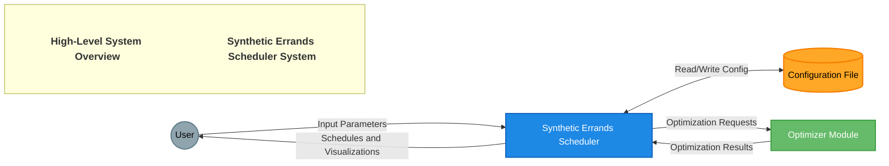
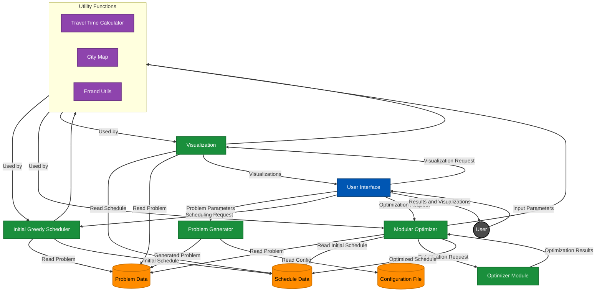

# Data Flow Diagram (DFD) for Synthetic Errands Scheduler

## Level 0 (Context) Diagram

## Level 1 Diagram

## Description

The Data Flow Diagram for the Synthetic Errands Scheduler illustrates how data moves through the system. At the highest level (Level 0), the system interacts with the User, who provides input parameters and receives schedules and visualizations. The system also interacts with a Configuration File for reading and writing settings, and with the Optimizer Module for optimization requests and results.

Diving deeper into Level 1, we can see the main processes and data stores within the system:

1. The User Interface (UI) serves as the primary point of interaction, receiving input from the user and presenting results.

2. The Problem Generator takes parameters from the UI and configuration from the Configuration File to create problem instances, which are stored in the Problem Data store.

3. The Initial Greedy Scheduler reads from the Problem Data store to create an initial schedule, which is then stored in the Schedule Data store.

4. The Modular Optimizer takes optimization requests from the UI, reads the problem and initial schedule data, and interacts with the Optimizer Module to produce an optimized schedule, which is then stored back in the Schedule Data store.

5. The Visualization component reads from both Problem Data and Schedule Data stores to create visualizations that are sent back to the UI for presentation to the user.

Throughout these processes, various Utility Functions (Travel Time Calculator, City Map, and Errand Utils) are used by different components to perform necessary calculations and data manipulations.

Data flows between these components primarily consist of problem parameters, generated problems, initial and optimized schedules, and visualization data. The system design allows for a clear separation of concerns, with distinct processes for problem generation, initial scheduling, optimization, and visualization, all orchestrated through the central User Interface component.

This data flow structure supports the modular nature of the system, allowing for easy updates or replacements of individual components (such as swapping out different optimizer algorithms) without affecting the overall data flow of the system.