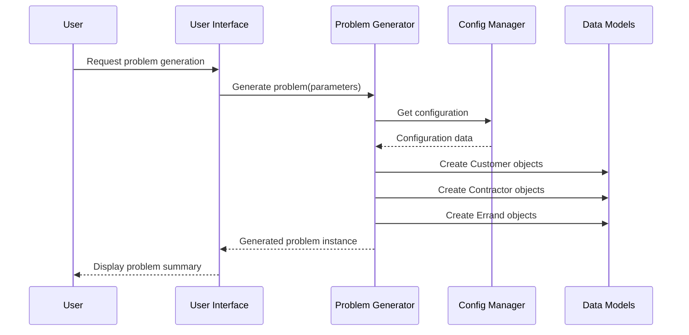
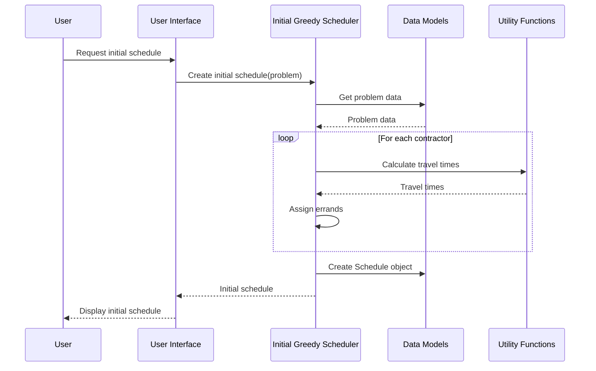
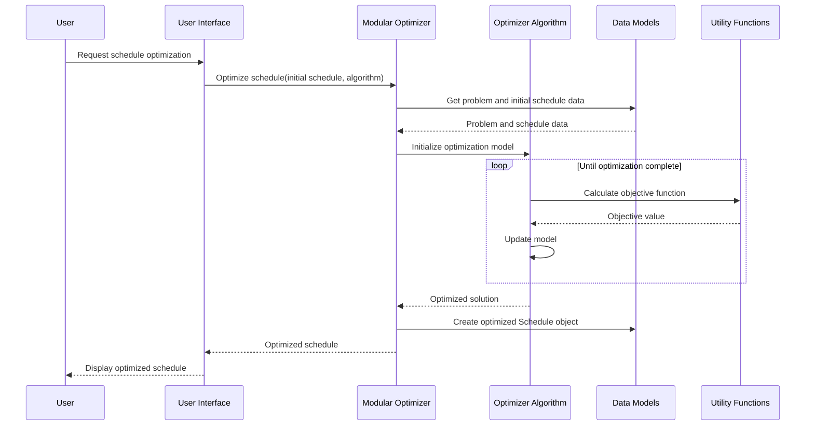
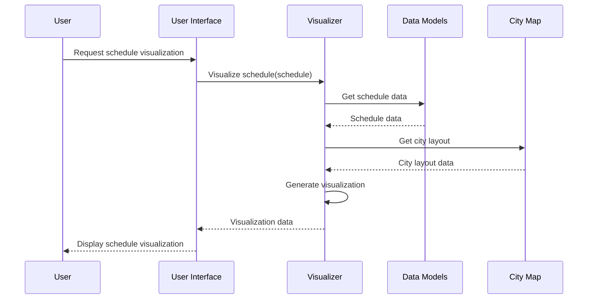

# Sequence Diagrams for Synthetic Errands Scheduler

## Introduction

The sequence diagrams presented here are closely related to the overall system architecture described in the System Architecture Document. They provide a dynamic view of how the components identified in the architecture interact to fulfill the system's requirements. These diagrams complement the static view provided by the system architecture, offering insights into the temporal aspects of the system's behavior.

The following sequence diagrams cover four key system operations:

1. Problem Generation
2. Initial Schedule Creation
3. Schedule Optimization
4. Schedule Visualization

These operations were chosen based on their importance in the system's workflow and their representation of core functionalities. By examining these diagrams, developers and stakeholders can gain a deeper understanding of how the system's components work together to achieve its goals.

## 1. Problem Generation

**Description**: This diagram illustrates the process of generating a problem instance. The user initiates the process through the UI, which then calls the Problem Generator. The Problem Generator retrieves necessary configuration data and creates the required data model objects (Customers, Contractors, and Errands). The generated problem instance is then returned to the UI for display to the user.

## 2. Initial Schedule Creation

**Description**: This sequence shows the creation of an initial schedule using the greedy algorithm. The Initial Greedy Scheduler retrieves the problem data and iterates through each contractor, calculating travel times and assigning errands. It then creates a Schedule object with the assignments and returns it to the UI for display.

## 3. Schedule Optimization

**Description**: This diagram depicts the process of optimizing a schedule. The Modular Optimizer uses the selected Optimizer Algorithm to improve the initial schedule. The optimization process involves iterative calculations of the objective function and model updates. The final optimized schedule is created and returned to the UI for display.

## 4. Schedule Visualization

**Description**: This sequence illustrates the process of visualizing a schedule. The Visualizer component retrieves the schedule data and city layout information, generates the visualization, and returns it to the UI for display to the user.

These sequence diagrams provide a detailed view of how different components of the Synthetic Errands Scheduler interact during key operations. They highlight the flow of control and data between various modules, helping developers understand the dynamic behavior of the system. This information is crucial for implementation, debugging, and future enhancements of the system.