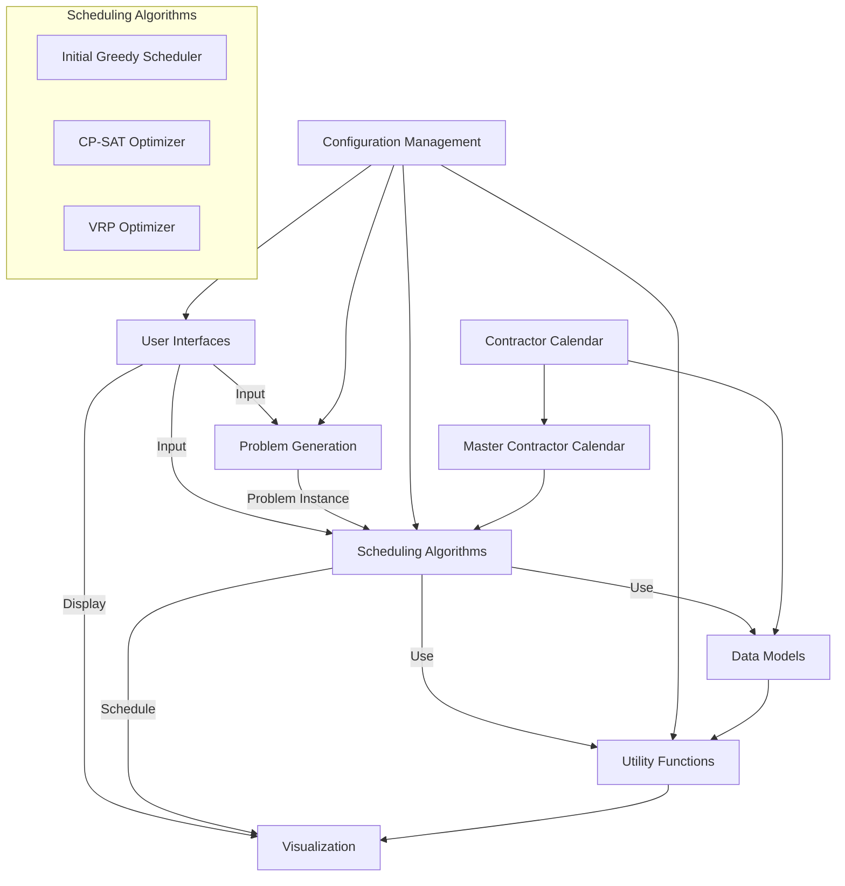

# System Architecture Document for Synthetic Errands Scheduler

## 1. Introduction

This document outlines the high-level system architecture for the Synthetic Errands Scheduler. It provides an overview of the system's structure, key components, and their interactions.

## 2. System Overview

The Synthetic Errands Scheduler is designed to optimize the scheduling of errands for Synthetic Errands Inc. The system uses a modular architecture to allow for flexibility in optimization algorithms and ease of maintenance.

## 3. High-Level Design

The system is composed of the following main components:

1. User Interfaces (GUI and CLI)
2. Problem Generation
3. Scheduling Algorithms
4. Data Models
5. Utility Functions
6. Configuration Management
7. Visualization

### 3.1 User Interfaces

#### 3.1.1 Graphical User Interface (GUI)
The GUI provides a user-friendly interface for interacting with the system. It consists of multiple tabs:
- Problem Definition Tab
- Generated Problem Tab
- Greedy Solution Tab
- Optimized Solution Tab
- Visualization Tab
- Contractor Schedules Tab

#### 3.1.2 Command-Line Interface (CLI)
The CLI allows for quick testing and integration into other workflows. It provides options for generating problems, running optimizations, and displaying results.

### 3.2 Problem Generation

This component is responsible for creating random problem instances based on user-defined parameters. It generates customers, contractors, and errands with specific attributes.

### 3.3 Scheduling Algorithms

The scheduling component consists of three main parts:
1. Initial Greedy Scheduler: Creates an initial schedule using a greedy approach, respecting contractor calendars.
2. CP-SAT Optimizer: Implements advanced optimization techniques using constraint programming, considering contractor availability.
3. Vehicle Routing Problem (VRP) Optimizer: Optimizes routes for contractors while respecting their calendars.

All scheduling algorithms take into account the contractor calendars when generating and optimizing schedules.

### 3.4 Data Models

The data models represent the core entities in the system:
- Customer
- Contractor
- Errand
- Schedule
- ContractorCalendar
- MasterContractorCalendar

These models encapsulate the data and business logic related to each entity. The ContractorCalendar model manages the availability of individual contractors, while the MasterContractorCalendar provides centralized management of all contractor calendars.

### 3.5 Utility Functions

Utility functions provide common functionality used across the system, including:
- Travel time calculations
- City map representation
- Errand utility functions

### 3.6 Configuration Management

This component manages system-wide constants and configuration parameters, allowing for easy modification of system behavior.

### 3.7 Visualization

The visualization component generates graphical representations of schedules and the city layout.

## 4. Data Flow

1. User inputs parameters through the GUI or CLI.
2. Problem Generation creates a random problem instance, including contractor calendars.
3. MasterContractorCalendar is initialized with all contractor calendars.
4. Initial Greedy Scheduler creates an initial schedule, using MasterContractorCalendar to check and update contractor availability.
5. Modular Optimizer (CP-SAT or VRP) improves the initial schedule while considering contractor calendars through MasterContractorCalendar.
6. Results are displayed to the user through the GUI or CLI.
7. Visualization component generates graphical representations of the schedules.

## 5. Interfaces and APIs

- GUI to Backend: The GUI components interact with the backend through a set of functions that handle problem generation, scheduling, and result retrieval.
- CLI to Backend: The CLI interface calls the same backend functions as the GUI.
- Modular Optimizer API: A standardized interface for different optimization algorithms, allowing easy integration of new algorithms.
- Configuration API: Provides access to system-wide constants and parameters.
- Contractor Calendar API: Provides methods for managing and querying individual contractor availability.
- MasterContractorCalendar API: Provides centralized methods for managing and querying all contractor calendars, including finding the first available slot across all contractors.

## 6. Component Diagram

The following Mermaid diagram illustrates the major components of the system and their interactions:

## 7. Extensibility and Modularity

The system's architecture is designed to be extensible and modular:
- New optimization algorithms can be easily added to the Modular Optimizer component.
- Additional utility functions can be implemented to support new features.
- The GUI can be extended with new tabs or functionality without affecting the core system.
- The modular structure allows for easy unit testing and maintenance.
- The ContractorCalendar and MasterContractorCalendar models can be extended to support more complex availability patterns.

## 8. Security Considerations

While the current system does not handle sensitive data, the following security considerations should be kept in mind for future development:
- Input validation to prevent injection attacks or system crashes.
- Proper error handling to avoid information leakage.
- Secure storage of any future user data or credentials.
- Ensure contractor calendar data is properly protected and only accessible to authorized users.

## 9. Performance Considerations

- The system should be optimized to handle problems with up to 100 customers and 20 contractors.
- Caching mechanisms can be implemented for frequently used calculations (e.g., travel times).
- The modular optimizer should be designed to allow for parallel processing of independent calculations.
- Efficient data structures should be used for contractor calendars and MasterContractorCalendar to ensure quick availability checks.

## 10. Future Considerations

- Implementation of additional optimizer algorithms.
- Integration with external data sources for real-world scheduling scenarios.
- Development of a web-based interface for broader accessibility.
- Implementation of real-time updates and dynamic rescheduling capabilities.
- Enhanced contractor calendar management, including recurring availability patterns and long-term scheduling.
- Integration with external calendar systems for automatic contractor availability updates.
- Mobile application for contractors to view and manage their schedules on-the-go.

This System Architecture Document provides a high-level overview of the Synthetic Errands Scheduler system. It serves as a guide for development and can be updated as the system evolves.