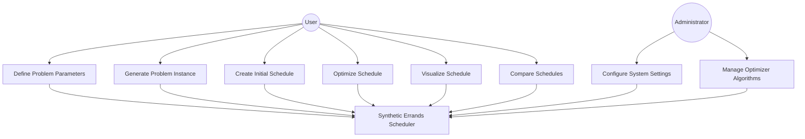

# Use Case Diagram and Descriptions for Synthetic Errands Scheduler

## Use Case Diagram

## Use Case Descriptions

### UC1: Define Problem Parameters

**Actor**: User

**Description**: The user sets parameters for the scheduling problem, including the number of customers, contractors, and specific constraints or preferences.

**Preconditions**: 
- The user has access to the Synthetic Errands Scheduler system.

**Main Flow**:
1. The user accesses the problem definition interface.
2. The user inputs the number of customers and contractors.
3. The user sets specific constraints (e.g., working hours, scheduling period).
4. The user defines errand types and their characteristics (base time, base charge, incentives, disincentives).
5. The system validates the input parameters.
6. The system saves the problem parameters.

**Alternate Flow**:
- If the input parameters are invalid, the system displays an error message and prompts the user to correct the input.

**Postconditions**: 
- The problem parameters are saved and ready for problem generation.

### UC2: Generate Problem Instance

**Actor**: User

**Description**: The user generates a random problem instance based on the defined parameters.

**Preconditions**: 
- Problem parameters have been defined (UC1).

**Main Flow**:
1. The user requests to generate a problem instance.
2. The system uses the defined parameters to create random customers, contractors, and errands.
3. The system displays the generated problem instance to the user.

**Postconditions**: 
- A problem instance is generated and ready for scheduling.

### UC3: Create Initial Schedule

**Actor**: User

**Description**: The user creates an initial schedule using the greedy algorithm.

**Preconditions**: 
- A problem instance has been generated (UC2).

**Main Flow**:
1. The user requests to create an initial schedule.
2. The system applies the greedy algorithm to the problem instance.
3. The system generates and displays the initial schedule.

**Postconditions**: 
- An initial schedule is created and displayed to the user.

### UC4: Optimize Schedule

**Actor**: User

**Description**: The user optimizes the schedule using the selected optimization algorithm.

**Preconditions**: 
- An initial schedule has been created (UC3).

**Main Flow**:
1. The user selects an optimization algorithm.
2. The user requests to optimize the schedule.
3. The system applies the selected optimization algorithm to improve the initial schedule.
4. The system generates and displays the optimized schedule.

**Alternate Flow**:
- If the optimization fails, the system displays an error message and retains the initial schedule.

**Postconditions**: 
- An optimized schedule is created and displayed to the user.

### UC5: Visualize Schedule

**Actor**: User

**Description**: The user views a graphical representation of a schedule.

**Preconditions**: 
- A schedule (initial or optimized) has been created.

**Main Flow**:
1. The user requests to visualize a schedule.
2. The system generates a graphical representation of the schedule, showing the city layout, customer and contractor locations, and routes.
3. The system displays the visualization to the user.

**Postconditions**: 
- A graphical visualization of the schedule is displayed to the user.

### UC6: Compare Schedules

**Actor**: User

**Description**: The user compares the initial greedy schedule with the optimized schedule.

**Preconditions**: 
- Both initial and optimized schedules have been created.

**Main Flow**:
1. The user requests to compare schedules.
2. The system displays a side-by-side comparison of the initial and optimized schedules, including metrics such as total profit and route efficiency.

**Postconditions**: 
- A comparison of the initial and optimized schedules is displayed to the user.

### UC7: Configure System Settings

**Actor**: Administrator

**Description**: The administrator configures global system settings.

**Preconditions**: 
- The administrator has access to the system configuration interface.

**Main Flow**:
1. The administrator accesses the system configuration interface.
2. The administrator modifies settings such as working hours, scheduling period, or default problem generation parameters.
3. The system validates the new configuration.
4. The system saves the updated configuration.

**Alternate Flow**:
- If the configuration is invalid, the system displays an error message and prompts the administrator to correct the input.

**Postconditions**: 
- The system configuration is updated and applied to future operations.

### UC8: Manage Optimizer Algorithms

**Actor**: Administrator

**Description**: The administrator manages the available optimization algorithms.

**Preconditions**: 
- The administrator has access to the optimizer management interface.

**Main Flow**:
1. The administrator accesses the optimizer management interface.
2. The administrator can add, remove, or modify optimization algorithms.
3. The system validates the changes to the optimizer algorithms.
4. The system updates the available optimizer algorithms.

**Alternate Flow**:
- If there's an error in adding or modifying an algorithm, the system displays an error message and prompts the administrator to correct the input.

**Postconditions**: 
- The available optimization algorithms are updated in the system.

This Use Case Diagram and the accompanying descriptions provide a comprehensive overview of the main functionalities of the Synthetic Errands Scheduler system and how users and administrators interact with it. This information will be valuable for understanding system requirements, guiding development, and creating user documentation.